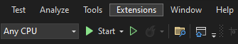
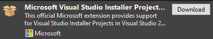
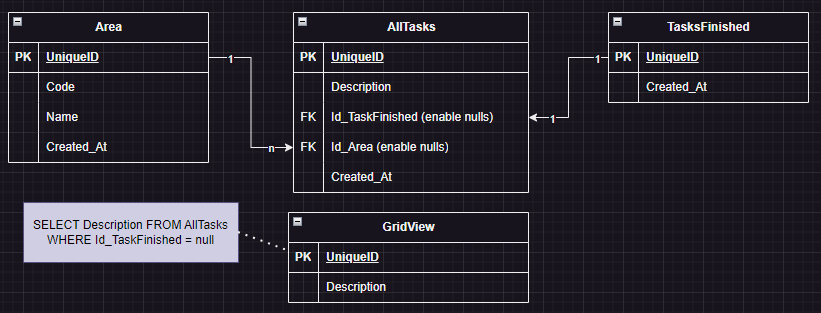
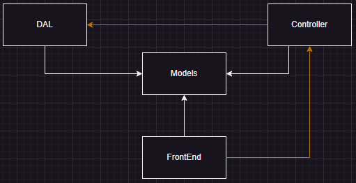

# TaskyApp

An application that enable get charts about your routines.

## Getting Started

1. We need to place Guna Library in this Path: _C:\Users\Public\Practices\Libraries\Guna\Guna UI Framework Ultimate v2.0.0.1 Lib-Master\Guna.UI WinForms\.net 2.0\Guna.UI.dll_

2. Local repository path: _C:\Users\Public\Practices\TaskyApp_

3. Path to build/**compile** project: _C:\Users\Public\Practices\TaskyApp\Build\TaskyApp_

    Path to build Installer: _C:\Users\Public\Practices\TaskyApp\Build\Setup_

4. We need to install this Visual Studio Extension:

    

    

## Requirements

* Add tasks related with area.
* Add areas.
* Add profile photo.
* See all Parts of the app.
* Make installer App.

## DataBase

## Dependencies Related

